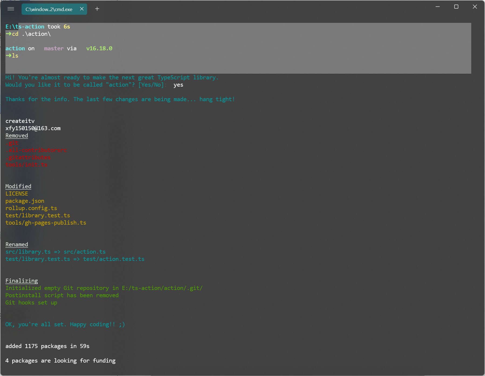

# ts-library-template


[](https://github.com/prettier/prettier)


A template project that makes creating a TypeScript library extremely easy.



### Features

- Zero-setup. After running `npm install` things will setup for you :wink:
- **[RollupJS](https://rollupjs.org/)** for multiple optimized bundles following
  the [standard convention](http://2ality.com/2017/04/setting-up-multi-platform-packages.html)
  and [Tree-shaking](https://alexjoverm.github.io/2017/03/06/Tree-shaking-with-Webpack-2-TypeScript-and-Babel/)
- Tests, coverage and interactive watch mode using **[Jest](http://facebook.github.io/jest/)**
- **[Prettier](https://github.com/prettier/prettier)**
  and **[TSLint](https://palantir.github.io/tslint/)** for code formatting and consistency
- **Docs automatic generation and deployment** to `gh-pages`,
  using **[TypeDoc](http://typedoc.org/)**
- Automatic types `(*.d.ts)` file generation
- **[Travis](https://travis-ci.org)** integration and **[Coveralls](https://coveralls.io/)** report
- (Optional) **Automatic releases and changelog**,
  using [Semantic release](https://github.com/semantic-release/semantic-release)
  , [Commitizen](https://github.com/commitizen/cz-cli)
  , [Conventional changelog](https://github.com/conventional-changelog/conventional-changelog)
  and [Husky](https://github.com/typicode/husky) (for the git hooks)

### Usage

```bash
git clone https://github.com/Createitv/ts-library-template.git YOURFOLDERNAME
cd YOURFOLDERNAME

# Run npm install and write your library name when asked. That's all!
npm install
```

**Start coding!** `package.json` and entry files are already set up for you, so don't worry about
linking to your main file, typings, etc. Just keep those files with the same name.

### Importing library

You can import the generated bundle to use the whole library generated by this starter:

```javascript
import myLib from 'mylib'
```

Additionally, you can import the transpiled modules from `dist/lib` in case you have a modular
library:

```javascript
import something from 'mylib/dist/lib/something'
```

### NPM scripts

- `npm t`: Run test suite
- `npm start`: Run `npm run build` in watch mode
- `npm run test:watch`: Run test suite
  in [interactive watch mode](http://facebook.github.io/jest/docs/cli.html#watch)
- `npm run test:prod`: Run linting and generate coverage
- `npm run build`: Generate bundles and typings, create docs
- `npm run lint`: Lints code
- `npm run commit`: Commit using conventional commit
  style ([husky](https://github.com/typicode/husky) will tell you to use it if you haven't :wink:)

### Excluding peerDependencies

On library development, one might want to set some peer dependencies, and thus remove those from the
final bundle. You can see in [Rollup docs](https://rollupjs.org/#peer-dependencies) how to do that.

Good news: the setup is here for you, you must only include the dependency name in `external`
property within `rollup.config.js`. For example, if you want to exclude `lodash`, just write
there `external: ['lodash']`.

### Automatic releases

_**Prerequisites**: you need to create/login accounts and add your project to:_

- [npm](https://www.npmjs.com/)
- [Travis CI](https://travis-ci.org)
- [Coveralls](https://coveralls.io)

#### To enable deployment, you will need to:

1. Setup `NPM_TOKEN` secret in GitHub
   actions ([Settings > Secrets > Actions](https://github.com/gjuchault/typescript-service-starter/settings/secrets/actions))
2. Give `GITHUB_TOKEN` write permissions for GitHub
   releases ([Settings > Actions > General](https://github.com/gjuchault/typescript-service-starter/settings/actions) >
   Workflow permissions)

From now on, you'll need to use `npm run commit`, which is a convenient way to create conventional
commits.

Automatic releases are possible thanks
to [semantic release](https://github.com/semantic-release/semantic-release), which publishes your
code automatically on [github](https://github.com/) and [npm](https://www.npmjs.com/), plus
generates automatically a changelog. This setup is highly influenced
by [Kent C. Dodds course on egghead.io](https://egghead.io/courses/how-to-write-an-open-source-javascript-library)

### Git Hooks

There is already set a `precommit` hook for formatting your code with Prettier :nail_care:

By default, there are two disabled git hooks. They're set up when you run
the `npm run semantic-release-prepare` script. They make sure:

- You follow
  a [conventional commit message](https://github.com/conventional-changelog/conventional-changelog)
- Your build is not going to fail in [Travis](https://travis-ci.org) (or your CI server), since it's
  runned locally before `git push`

This makes more sense in combination with [automatic releases](#automatic-releases)

#### What is `npm install` doing on first run?

It runs the script `tools/init` which sets up everything for you. In short, it:

- Configures RollupJS for the build, which creates the bundles
- Configures `package.json` (typings file, main file, etc)
- Renames main src and test files

#### What if I don't want git-hooks, automatic releases or semantic-release?

Then you may want to:

- Remove `commitmsg`, `postinstall` scripts from `package.json`. That will not use those git hooks
  to make sure you make a conventional commit
- Remove `npm run semantic-release` from `.travis.yml`

#### What if I don't want to use coveralls or report my coverage?

Remove `npm run report-coverage` from `.travis.yml`
